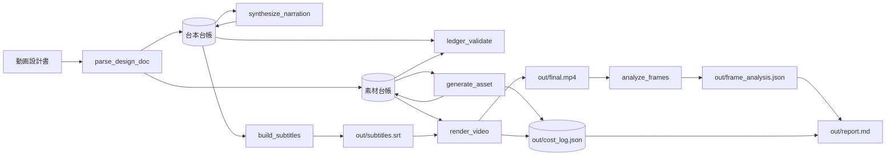

# データフロー

外部との境界は次の3か所です。いずれも利用者の環境で動きます。

| 境界 | 相手 | 資格情報 |
|---|---|---|
| generate_asset | 生成 API | 必要です（環境変数から読みます） |
| synthesize_narration | ローカル TTS | 不要です |
| render_video | Remotion | 不要です |
