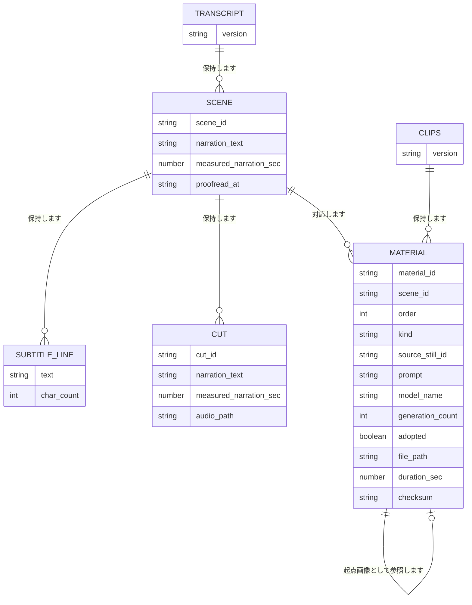

# データモデル

台帳の構造です。定義の正は `src/skills/spec-to-video/assets/` の各スキーマです。

```mermaid
erDiagram
    TRANSCRIPT ||--o{ SCENE : "保持します"
    SCENE ||--o{ SUBTITLE_LINE : "保持します"
    SCENE ||--o{ CUT : "保持します"
    CLIPS ||--o{ MATERIAL : "保持します"
    SCENE ||--o{ MATERIAL : "対応します"
    MATERIAL ||--o| MATERIAL : "起点画像として参照します"

    TRANSCRIPT {
        string version
    }
    SCENE {
        string scene_id
        string narration_text
        number measured_narration_sec
        string proofread_at
    }
    SUBTITLE_LINE {
        string text
        int char_count
    }
    CUT {
        string cut_id
        string narration_text
        number measured_narration_sec
        string audio_path
    }
    CLIPS {
        string version
    }
    MATERIAL {
        string material_id
        string scene_id
        int order
        string kind
        string source_still_id
        string prompt
        string model_name
        int generation_count
        boolean adopted
        string file_path
        number duration_sec
        string checksum
    }
```

シーンとカットの実尺は、合成した音声を計測した値です。カットの実尺の合計がシーンの実尺になります。
