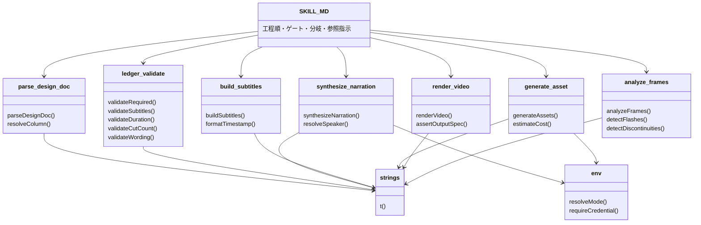

# モジュール構成

```mermaid
classDiagram
    class SKILL_MD {
        工程順・ゲート・分岐・参照指示
    }
    class parse_design_doc {
        parseDesignDoc()
        resolveColumn()
    }
    class ledger_validate {
        validateRequired()
        validateSubtitles()
        validateDuration()
        validateCutCount()
        validateWording()
    }
    class synthesize_narration {
        synthesizeNarration()
        resolveSpeaker()
    }
    class build_subtitles {
        buildSubtitles()
        formatTimestamp()
    }
    class generate_asset {
        generateAssets()
        estimateCost()
    }
    class render_video {
        renderVideo()
        assertOutputSpec()
    }
    class analyze_frames {
        analyzeFrames()
        detectFlashes()
        detectDiscontinuities()
    }
    class strings {
        t()
    }
    class env {
        resolveMode()
        requireCredential()
    }

    SKILL_MD --> parse_design_doc
    SKILL_MD --> ledger_validate
    SKILL_MD --> synthesize_narration
    SKILL_MD --> build_subtitles
    SKILL_MD --> generate_asset
    SKILL_MD --> render_video
    SKILL_MD --> analyze_frames
    parse_design_doc --> strings
    ledger_validate --> strings
    synthesize_narration --> strings
    synthesize_narration --> env
    build_subtitles --> strings
    generate_asset --> strings
    generate_asset --> env
    render_video --> strings
    analyze_frames --> strings
```

すべてのスクリプトが `strings` を経由して文言を取得します。外部呼び出しを行うものだけが `env` に依存します。
