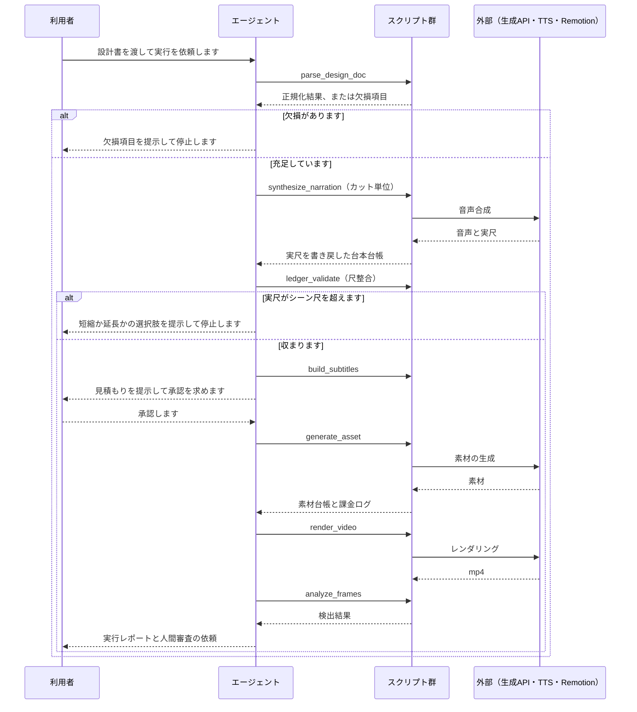

# シーケンス

全工程を実行する場合の流れです。

```mermaid
sequenceDiagram
    participant U as 利用者
    participant A as エージェント
    participant S as スクリプト群
    participant X as 外部（生成API・TTS・Remotion）

    U->>A: 設計書を渡して実行を依頼します
    A->>S: parse_design_doc
    S-->>A: 正規化結果、または欠損項目
    alt 欠損があります
        A-->>U: 欠損項目を提示して停止します
    else 充足しています
        A->>S: synthesize_narration（カット単位）
        S->>X: 音声合成
        X-->>S: 音声と実尺
        S-->>A: 実尺を書き戻した台本台帳
        A->>S: ledger_validate（尺整合）
        alt 実尺がシーン尺を超えます
            A-->>U: 短縮か延長かの選択肢を提示して停止します
        else 収まります
            A->>S: build_subtitles
            A-->>U: 見積もりを提示して承認を求めます
            U-->>A: 承認します
            A->>S: generate_asset
            S->>X: 素材の生成
            X-->>S: 素材
            S-->>A: 素材台帳と課金ログ
            A->>S: render_video
            S->>X: レンダリング
            X-->>S: mp4
            A->>S: analyze_frames
            S-->>A: 検出結果
            A-->>U: 実行レポートと人間審査の依頼
        end
    end
```
