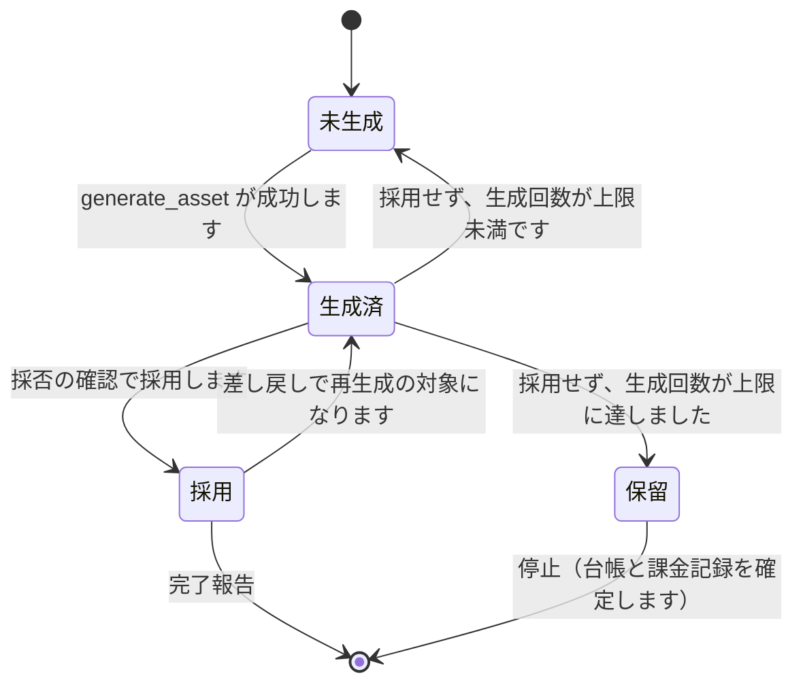

# 状態遷移

素材1点の状態です。

```mermaid
stateDiagram-v2
    [*] --> 未生成
    未生成 --> 生成済: generate_asset が成功します
    生成済 --> 採用: 採否の確認で採用します
    生成済 --> 未生成: 採用せず、生成回数が上限未満です
    生成済 --> 保留: 採用せず、生成回数が上限に達しました
    採用 --> 生成済: 差し戻しで再生成の対象になります
    採用 --> [*]: 完了報告
    保留 --> [*]: 停止（台帳と課金記録を確定します）
```

採用済みの素材は、再実行時に再生成しません。差し戻しで対象になった素材だけが「生成済」へ戻ります。
