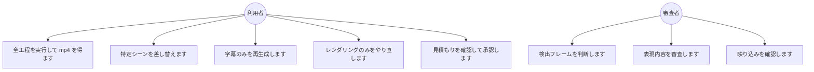

# ユースケース

| ユースケース | 開始工程 | 課金 |
|---|---|---|
| 全工程を実行します | P1 | 生成とレンダリング |
| 特定シーンを差し替えます | P9 または P10（該当素材のみ） | 再生成 |
| 字幕のみを再生成します | P6 | なし（P11 と P12 のレンダのみ） |
| レンダリングのみをやり直します | P12 | レンダのみ |
