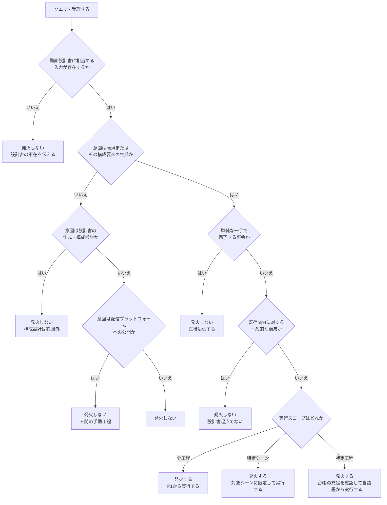
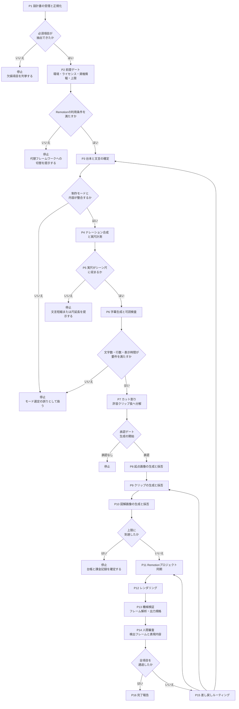
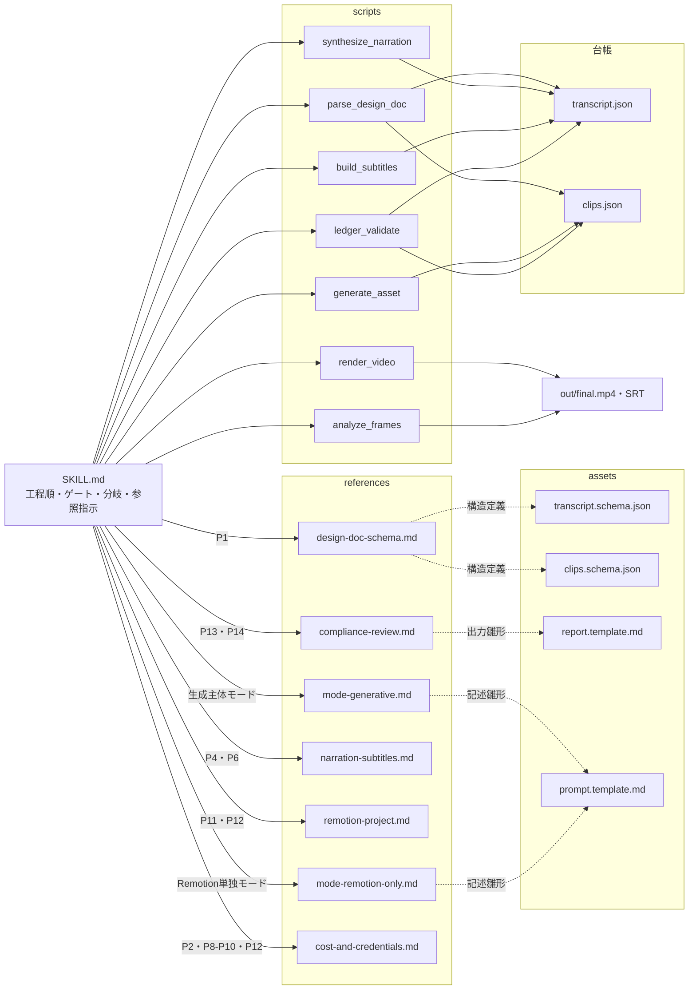

# spec-to-video — エージェントスキル仕様書（製品版フルエディション）

## 1. 概要

| 項目 | 内容 |
|---|---|
| リポジトリ名 | `spec-to-video-pipeline` |
| スキル名（`name`） | `spec-to-video` |
| 対象エディション | 製品版フルエディション（全構成・3ツール対応・保守／監視あり） |
| プラットフォーム | エージェントスキル（Agent Skills / SKILL.md） |
| 配信方式 | 配布型（利用者の環境で、利用者の資格情報により実行される） |
| デザイン | あり（出力フォーマットの定義とテンプレートを備える） |
| 測定 | あり（第23節） |
| 保守 | あり（第21節） |
| 監視 | あり（第22節） |

### 1.1 プラットフォーム選定の理由

本スキルの成果物を直接読み、手順に従って実行するのはAIエージェントである。渡すものは「何をどの順でやるか」という手順であり、実行主体はエージェント自身、状態は保持しない。設計書の読解・生成プロンプトの設計・カット採否の判断はいずれもエージェントの判断であり、サーバー側コードの実行を要さない。データ永続化とマルチユーザー対応も要件に含まれない。以上より、能力提供（MCPサーバー・API・SDK・CLI）ではなく手順定義に該当する。

### 1.2 適用範囲

本スキルは、動画設計書を入力として、生成素材の取得・ナレーションの合成・字幕の生成・Remotionによる合成・コンプライアンス検証を経て、mp4と付随成果物を出力する工程を対象範囲とする。配信プラットフォームへのアップロード、および動画設計書そのものの作成は範囲に含まない。

---

## 2. 対象仕様とバージョン

本領域は仕様変更が速いため、対象とする標準・ツール・モデルのバージョンと参照日を以下に明記する。参照した一次情報のURLと参照日は `docs/references.md` に記録し、改訂のたびに更新する。

| 対象 | バージョン／状態 | 一次情報 | 参照日 |
|---|---|---|---|
| Agent Skills標準 | 1.0.0（最終更新 2026-04-01） | https://agentskills.my/specification/ | 2026-08-23 |
| Claude Code（Skills） | 導入環境で確定し `docs/references.md` に記録 | https://code.claude.com/docs/en/skills | 2026-08-23 |
| Codex（Skills） | 導入環境で確定し `docs/references.md` に記録 | https://developers.openai.com/codex/skills | 2026-08-23 |
| Antigravity（Skills） | 導入環境で確定し `docs/references.md` に記録 | https://antigravity.google/docs/skills | 2026-08-23 |
| Remotion ライセンス | 営利4人以上はCompany License（Automatorsはレンダ単位課金） | https://www.remotion.dev/docs/license/faq | 2026-08-23 |
| 生成モデル（クリップ・図解） | スキルには埋め込まず、動画設計書の「使用モデル」表から読む | 設計書側で記録 | 設計書側で記録 |

### 2.1 モデル名を埋め込まない設計の理由

生成モデルの提供状況と呼称は短期間で変動する。本スキルはモデル名・エンドポイント・許容クリップ長を、動画設計書の「使用モデル」表と実行環境の設定から取得し、素材台帳に記録する。スキル本体はモデル非依存の記述（被写体・動き・カメラワーク・尺）に限定する。

---

## 3. 対象ターゲットとホスト差異の方針

### 3.1 対象ホスト

Claude Code・Codex・Antigravityの3ツールを対象とする。

### 3.2 ホスト非依存化の方針

| 論点 | 方針 |
|---|---|
| 任意ディレクトリの命名 | 標準の `references/`・`assets/`・`scripts/` を採用する。ホストごとの慣習名（`examples/`・`resources/` 等）には依拠せず、SKILL.md本文から相対パスで各ファイルを明示参照する |
| ホスト固有フィールド | 使用しない。汎用コアのみで完結させ、必要が生じた場合はツール固有ラッパーとして分離する |
| 暗黙発火の可否 | ホストごとに既定が異なるため、発火の抑止に依存しない。課金を伴う工程の直前に承認ゲートを置き、発火そのものが副作用を持たない構造とする |
| 設置 | リポジトリを唯一の正とし、各ツールのスキルディレクトリへはsymlinkで配布する |
| 挙動差の扱い | 第22節の監視で検知し、第21節の改訂フローで汎用コア側を是正する |

---

## 4. 課題と解決の構造

動画設計書からmp4に至る工程は、決定的な処理（ナレーション合成・字幕生成・レンダリング・フレーム解析）と、判断を要する処理（設計書の読解・プロンプト設計・素材の採否）が交互に現れる。後者は毎回同じ判断基準を指示し直す対象であり、前者はスクリプトに固定できる。本スキルは、この二種を工程順に配置し、工程間にゲートを置いた手順として定義する。

---

## 5. 用語定義

| 用語 | 定義 |
|---|---|
| シーン | 動画設計書のシーン構成表における1行。尺と字幕と映像内容を持つ |
| カット | 1つの生成素材に対応する区間。1シーンは1つ以上のカットで構成される |
| 起点画像 | image-to-video生成の入力となる開始フレーム画像 |
| 素材台帳 | 素材ファイルと、そのプロンプト・モデル名・生成日・採否を紐づけた記録。素材に関する単一の正である |
| 再レンダリング | 既存の採用素材を用いて合成をやり直す操作。決定的であり、素材は変化しない |
| 再生成 | 生成モデルを再度呼び出す操作。同一の素材は得られず、課金を伴う |
| ゲート | 次工程へ進む前提条件。満たさない場合は停止し、不足を提示する |
| 承認ゲート | 課金を伴う工程の直前に置かれ、人間の確認を要求するゲート |

---

## 6. 発火条件の設計方針

発火は `description` によって決まるため、発火条件は本文ではなくメタデータに集約する。`description` には、何をするか（動画設計書からmp4を生成する）と、どの文脈で使うか（設計書が存在し、素材生成・ナレーション・合成・検証を通してmp4を得ようとしている場面）の双方を含める。

### 6.1 発火する条件

以下の双方を満たす場合に発火する。

1. 動画設計書に相当する入力が存在する（ファイルパスの提示、リポジトリ内の設計書の存在、または会話中での設計内容の提示）。
2. mp4またはその構成要素（素材・ナレーション・字幕・合成・検証）の生成を意図している。

部分実行の依頼（特定シーンの差し替え、字幕のみの再生成、レンダリングのみ）も、上記2条件を満たすため発火対象とする。

### 6.2 発火しない条件

| 状況 | 理由 |
|---|---|
| 動画設計書が存在しない状態での動画制作の依頼 | 入力が欠けており、設計書の作成は別の作業である |
| 動画設計書そのものの作成・構成検討の依頼 | 本スキルの範囲外である |
| 既存mp4に対する一般的な編集・変換の依頼 | 設計書を起点とする工程ではない |
| 配信プラットフォームへの公開の依頼 | 人間が手動で行う工程である |
| 単純な一手で完了する照会（尺の確認、ファイルの一覧等） | エージェントが直接処理でき、手順を要さない |

### 6.3 発火判定における設計上の担保

発火が抑止されないホストでも副作用が生じないよう、課金と不可逆な生成を伴う工程（起点画像・クリップ・図解の生成）の直前に承認ゲートを置く。発火のみでは素材生成もレンダリングも開始されない。

---

## 7. 発火判定の決定木

---

## 8. 入出力フォーマットの定義

### 8.1 入力：動画設計書の正規化スキーマ

動画設計書はMarkdownで記述され、見出し・表の構成には揺れがある。抽出結果は以下の構造に正規化する。列名の表記揺れは同義語辞書で吸収し、対応が付かない必須項目は推測で補完せず、欠損項目を列挙して停止する。

| 区分 | 項目 | 必須 | 内容 |
|---|---|---|---|
| meta | repository | 必須 | リポジトリ名 |
| meta | title_candidates | 任意 | 動画タイトル案 |
| meta | edition | 必須 | 設計書側のエディション |
| meta | production_mode | 必須 | `remotion_only` または `generative` |
| meta | models | 必須 | クリップ・静止画・TTS・編集の各モデルと参照日 |
| constraints | items[] | 必須 | 構成要件。機械検査対象と目視審査対象に分類して保持する |
| scenes[] | scene_id | 必須 | シーン識別子 |
| scenes[] | duration_sec | 必須 | シーン尺 |
| scenes[] | cuts[] | 必須 | カットの一覧。カットごとに識別子・素材種別（`clip` / `figure` / `title_card`）・尺を持つ。1つのシーンに複数の素材種別が混在してよい |
| scenes[] | material_count | 必須 | 設計書が指定するカット数。`cuts[]` の件数と一致すること |
| scenes[] | visual | 必須 | 映像内容の記述 |
| scenes[] | subtitles[] | 必須 | 字幕行 |
| scenes[] | narration_policy | 必須 | ナレーション方針 |
| scenes[] | intentional_luminance_change | 必須 | 意図的な輝度・色変化を含むか |
| output_spec | resolution / fps / codec / audio | 必須 | 出力規格 |
| cost_policy | retry_limit / hard_cap | 必須 | カット単位のリトライ上限と課金上限。いずれも数値とする（通貨単位は設計書の記載に従う） |
| narration | engine / speaker | 必須 | 合成エンジンと話者 |

### 8.2 中間成果物：台帳

素材とテキストの単一の正を、二つの台帳として保持する。

**台本台帳（`data/transcript.json`）**

| 項目 | 内容 |
|---|---|
| scene_id | シーン識別子 |
| subtitle_lines[] | 字幕行（行ごとの文字数を保持する） |
| narration_text | ナレーション原文 |
| figure_text[] | 図解内に含める文言 |
| measured_narration_sec | 合成後に計測した実尺 |
| proofread_at | 校正完了日時 |

**素材台帳（`data/clips.json`）**

| 項目 | 内容 |
|---|---|
| material_id | 素材識別子 |
| scene_id / order | 所属シーンと並び順 |
| kind | `still_seed` / `clip` / `figure` / `title_card` |
| source_still_id | クリップの起点画像への参照 |
| prompt | 生成に用いた記述（被写体・動き・カメラワーク・尺・回避指定） |
| model_name / model_version / generated_at | モデルと生成日時 |
| generation_count | 当該素材に対する生成回数 |
| adopted | 採否 |
| file_path / duration_sec / checksum | ファイルと実尺と同一性 |
| review | 映り込み確認・文言校正・規約確認日 |

### 8.3 出力フォーマット

| ファイル | 内容 |
|---|---|
| `out/final.mp4` | 設計書の出力規格に適合した本編 |
| `out/subtitles.srt` | 台本台帳から生成した字幕 |
| `out/frame_analysis.json` | 明滅・赤成分・不連続フレームの検出結果 |
| `out/cost_log.json` | 生成回数・レンダ回数・課金額の記録 |
| `out/report.md` | 実行レポート（第8.4節） |

### 8.4 実行レポートの構成

実行レポートは `assets/` のテンプレートに従い、以下の見出しで構成する。資格情報およびその一部を含めない。

1. 対象設計書と実行スコープ
2. 生成素材の一覧（採用素材と生成回数）
3. ナレーション実尺とシーン尺の対照
4. 字幕の可読検査の結果
5. 機械検証の検出一覧と該当区間
6. 人間審査を要する項目
7. 課金の記録
8. 未完了の工程と差し戻し先

---

## 9. 手順の論理構造

工程は決定的で安価なものを前段に、不可逆で課金を伴うものを後段に配置する。各工程は入口ゲートを持ち、台帳の必須項目が充足していない場合は停止する。

| 工程 | 名称 | 種別 | 入口ゲート |
|---|---|---|---|
| P1 | 設計書の受理と正規化 | 判断＋script | 設計書が読み取れる |
| P2 | 前提ゲート | 判断 | 環境・ライセンス・資格情報・上限が確定している |
| P3 | 台本と文言の確定 | 判断 | 正規化が完了している |
| P4 | ナレーション合成と実尺計測 | script | 台本が校正済みである |
| P5 | 尺整合ゲート | script | 実尺が計測済みである |
| P6 | 字幕生成と可読検査 | script | 尺整合が成立している |
| P7 | カット割り | 判断＋script | 許容クリップ長が台帳に登録されている |
| P8 | 起点画像の生成と採否 | 判断（承認ゲート） | カット割りが確定している |
| P9 | クリップの生成と採否 | 判断（承認ゲート） | 起点画像が採用済みである |
| P10 | 図解画像の生成と採否 | 判断（承認ゲート） | 図解文言が校正済みである |
| P11 | Remotionプロジェクト同期 | 判断 | 全素材が採用済みである |
| P12 | レンダリング | script | 出力規格が設定済みである |
| P13 | 機械検証 | script | mp4が存在する |
| P14 | 人間審査 | 人間 | 機械検証が完了している |
| P15 | 差し戻しルーティング | 判断 | 検証で不適合がある |
| P16 | 完了報告 | script | 全検証を通過している |

### 9.1 制作モードによる分岐

| 工程 | 生成主体モード | Remotion単独モード |
|---|---|---|
| P8 | 起点画像を生成する | 該当しない |
| P9 | image-to-videoでクリップを生成する | 手描き表現シーンを実装する |
| P10 | 静的図解画像を生成する | アニメーション図解を実装する |
| 3D素材 | 該当しない | 3D空間配置・カメラ移動・物理演算のいずれかを満たすカットのみ、ヘッドレス実行で連番素材を書き出す |

参照する詳細手順は `references/mode-generative.md` と `references/mode-remotion-only.md` に分離し、正規化した `production_mode` に応じて一方のみを読み込む。

### 9.2 主要な分岐条件

| 判定 | 条件 | 分岐 |
|---|---|---|
| モード整合 | 生成主体モードの設計書に、視聴者がそのまま入力することを想定する文字列が字幕・図解文言に存在する | モード選定の誤りとして停止し、設計書の修正を要する旨を提示する |
| 尺整合 | ナレーション実尺がシーン尺を超える | 停止し、文言短縮または尺延長の選択肢を提示する |
| 尺整合 | ナレーション実尺がシーン尺を大きく下回る | 継続し、実行レポートに差分を記録する |
| カット割り | シーン尺が許容クリップ長の組合せで一致しない | 超過分を生成し、余剰をRemotion側のトリムで吸収する。カット数は設計書の指定に一致させる |
| 生成の失敗 | 同一素材の生成回数がリトライ上限に達する | 当該素材を保留し、他素材を続行したうえで停止する |
| コスト | 課金額がハードキャップに達する | 全生成を停止し、台帳と課金記録を確定する |
| 再実行 | 素材台帳に採用済みの素材が存在する | 再生成せず既存素材を用いる |

---

## 10. 手順フロー図

---

## 11. 差し戻しルーティングの定義

検証で不適合が生じた場合、原因区間に応じて差し戻し先を決定する。再レンダリングで解消できる不適合に対して再生成を選択しない。

| 検出区間 | 想定原因 | 差し戻し先 | 課金 |
|---|---|---|---|
| トランジション区間 | 遷移の設定・重なり | P11（Remotionプロジェクト同期） | レンダのみ |
| 字幕・オーバーレイ層 | 表示時間・配置・書式 | P11 | レンダのみ |
| 単一素材の区間内 | 素材そのものの明滅・グリッチ・映り込み | P9またはP10（該当素材のみ） | 再生成 |
| 図解内の文言 | 誤字・文字の崩れ | P3で文言を確定し直し、P10で再生成 | 再生成 |
| 全編にわたる規格不一致 | 出力設定 | P12 | レンダのみ |
| シーン尺・字幕文言に起因 | 設計そのもの | P3（設計書の修正を要する） | なし |

差し戻し時、素材台帳の採用済み素材は保持し、対象素材のみを再生成の対象とする。

---

## 12. 検証の設計要件

### 12.1 台帳段階で機械検査する項目

| 項目 | 検査内容 |
|---|---|
| 字幕の可読 | 1行あたりの文字数上限、行数上限、表示時間の下限 |
| 文脈自立 | 各シーンの字幕が単体で状況を示す構造であること |
| 尺整合 | ナレーション実尺とシーン尺の関係 |
| カット長の合法性 | 生成尺が許容クリップ長の組合せで表現できること |
| カット数の一致 | 設計書のカット数と台帳の素材数の一致 |
| 文言確定 | 図解文言の校正完了フラグが立っていること |
| 用語の平易性 | 除外語彙リストに該当する語が字幕・図解文言・ナレーションに含まれないこと |

### 12.2 最終mp4に対して機械検証する項目

| 項目 | 検査内容 |
|---|---|
| 光感受性 | 隣接フレーム間の輝度差を計測し、輝度変化を伴う点滅の頻度が安全基準を超えないこと。鮮やかな赤の点滅を別に計測すること |
| 規則的パターン | 縞・渦巻き・同心円が画面の大部分を占める区間の有無 |
| 不連続フレーム | シーン変化検出により前後と不連続な短時間フレームを抽出すること。設計書で意図的な輝度・色変化が宣言されたシーンは、宣言区間を除外したうえで判定すること |
| 出力規格 | 解像度・フレームレート・コーデック・音声形式の一致 |
| グレースケール | 変換後に意味が失われないこと（判定は人間審査と併用する） |

### 12.3 人間が審査する項目

- 機械検出されたフレームの最終判断
- 表現内容（差別的表現・過度に刺激的な表現・誤解を招く表現）の審査
- 意図しない文字・ロゴ・実在人物の映り込みの最終確認
- 素材間の質感連続性（配色・明度・動きの速度）の通し再生による確認

参照する審査基準・そのバージョン・確認日は `docs/references.md` に記録する。

---

## 13. 参照ファイル・スクリプトの構成と分割方針

### 13.1 分割の方針

SKILL.md本文は、工程順・ゲート条件・分岐条件・参照先の指示に限定する。詳細な基準と手順は参照ファイルへ委譲し、どの条件でどれを読むかを本文に明示する。決定的で反復する処理はスクリプトへ委譲する。制作モードのように排他的な二系統は、モードごとの参照ファイルに分離し、一方のみを読み込む構成とする。

### 13.2 参照ファイル

| ファイル | 読み込み条件 | 内容 |
|---|---|---|
| `references/design-doc-schema.md` | P1 | 正規化スキーマ、列名の同義語辞書、欠損時の扱い |
| `references/mode-generative.md` | `production_mode` が生成主体モードのとき（P8〜P10） | 起点画像とimage-to-videoの手順、プロンプト設計指針、素材採否の基準、静的図解の扱い |
| `references/mode-remotion-only.md` | `production_mode` がRemotion単独モードのとき（P8〜P10） | 手描き表現の規約、アニメーション図解の設計、3D素材の適用条件と受け渡し |
| `references/narration-subtitles.md` | P4・P6 | ローカルTTSの実行手順、話者設定の反映、実尺計測、字幕生成と可読規約 |
| `references/remotion-project.md` | P11・P12 | プロジェクト構成規約、遷移の実装方針、フレーム依存の純粋関数としての実装制約、出力規格の設定 |
| `references/compliance-review.md` | P13・P14 | 審査基準と参照規格、意図的変化シーンの扱い、検出結果の読み方 |
| `references/cost-and-credentials.md` | P2・P8〜P10・P12 | リトライ上限とハードキャップの運用、課金ログの項目、環境変数名、ライセンス判定 |

300行を超える参照ファイルには目次を付す。

### 13.3 スクリプト

| スクリプト | 対応工程 | 役割 |
|---|---|---|
| `scripts/parse_design_doc` | P1 | 設計書を正規化構造へ変換し、欠損項目を列挙する |
| `scripts/ledger_validate` | P3・P5・P6・P7・P11 | 台帳の必須項目と第12.1節の機械検査を実行する |
| `scripts/synthesize_narration` | P4 | ナレーションを合成し、実尺を計測して台本台帳へ書き戻す |
| `scripts/build_subtitles` | P6 | 台本台帳から字幕ファイルを生成する |
| `scripts/generate_asset` | P8・P9・P10 | 生成呼び出しの単一窓口。リトライ上限・ハードキャップ・課金ログを一元的に適用する |
| `scripts/render_video` | P12 | レンダリングを実行し、レンダ回数を課金ログへ計上する |
| `scripts/analyze_frames` | P13 | 第12.2節の検出を実行し、結果と該当区間を出力する |

### 13.4 アセット

| アセット | 用途 |
|---|---|
| `assets/transcript.schema.json` | 台本台帳の構造定義 |
| `assets/clips.schema.json` | 素材台帳の構造定義 |
| `assets/report.template.md` | 実行レポートの雛形 |
| `assets/prompt.template.md` | 生成記述の雛形（被写体・動き・カメラワーク・尺・回避指定） |

---

## 14. リソース構成図

---

## 15. 資格情報と権利の取り扱い

| 項目 | 方針 |
|---|---|
| 生成APIの資格情報 | 利用者の環境変数から読む。スキル本文・参照ファイル・スクリプト・アセットに直書きしない。必要な変数名のみを記載する |
| ログ・台帳・レポート | 資格情報およびその一部を記録しない。エラー出力に含まれた場合は伏せて記録する |
| ローカルTTS | ネットワーク通信と資格情報を要さない。モデル・音声データは事前導入を前提とし、実行中に取得しない |
| 実在の個人情報 | 成果物・台帳・レポートに、実在の個人を特定できる情報を記載しない。画面内への表示も行わない |
| 第三者の著作物 | 引用の要件（主従関係・出典明示・改変禁止）を満たす範囲でのみ使用する |
| 生成物の権利 | 使用するモデルの利用規約で商用利用可否を確認し、確認日を記録する。実在の人物・ロゴ・他社著作物の生成回避を記述に明示し、映り込んだ素材は採用しない |
| フレームワークのライセンス | 組織規模により利用条件が変わるため、P2で判定する。条件を満たさない場合は代替フレームワークへの切替を提示する |

---

## 16. コスト管理の設計要件

生成呼び出しとレンダリングは、いずれも従量課金となり得る。エージェントの反復により意図しない課金が積み上がるため、以下を設計に組み込む。

1. 生成呼び出しは単一のスクリプトを窓口とし、直接呼び出しの経路を持たない。
2. 素材単位のリトライ上限と、セッション単位のハードキャップを分離して管理する。いずれかに到達した場合は生成を停止し、台帳と課金記録を確定する。
3. レンダリング回数も課金記録の対象に含める。レンダ単位課金の条件下では、検証の反復が課金に直結する。
4. 素材台帳を単一の正とし、採用済み素材は再実行時に再生成しない。中断からの再開は差分のみを対象とする。
5. 構図・被写体のリテイクは起点画像の段階で行い、動画生成の失敗課金を抑える。
6. 想定生成コストの見積もり方は、クリップ単価と動画素材総尺とリテイク係数の積に、静止画単価と点数とリテイク係数の積を加える形で算出する。

---

## 17. 規模

| 項目 | 想定 |
|---|---|
| SKILL.md想定行数 | 約320行（上限の目安である500行以内） |
| 参照ファイル数 | 7 |
| スクリプト数 | 7 |
| アセット数 | 4 |
| 対象ホスト数 | 3 |
| 定義工程数 | 16 |

---

## 18. 設計要件

検証を通じて確定した、本スキルが満たす設計要件を以下に定める。

1. **工程順序の要件** — 決定的かつ安価な工程を、不可逆かつ課金を伴う工程より前に配置する。ナレーションの実尺計測は、映像素材の生成より前に完了する。
2. **入口ゲートの要件** — 各工程は台帳の必須項目の充足を入口条件とする。参照ファイルを読み込まずに実行された場合、台帳が充足しないため当該工程は停止し、誤った成果物は生成されない。
3. **推測補完の禁止** — 設計書から抽出できない必須項目は補完せず、欠損を列挙して停止する。
4. **承認ゲートの要件** — 課金と不可逆な生成を伴う工程は、直前の承認を実行条件とする。発火のみでは素材生成もレンダリングも開始されない。
5. **冪等性の要件** — 素材台帳を単一の正とし、採用済み素材は再生成の対象としない。
6. **差し戻しの最小化** — 再レンダリングで解消できる不適合に対して再生成を選択しない。差し戻し先は検出区間から決定する。
7. **意図的変化の宣言** — 意図的な輝度・色変化を含むシーンは設計書で宣言され、機械検出はその宣言区間を除外して不連続を判定する。
8. **モード整合の要件** — 生成主体モードにおいて、視聴者がそのまま入力することを想定する文字列が台本に存在する場合、モード選定の誤りとして扱い、代替表現による回避を行わない。
9. **モデル非依存の要件** — モデル名・許容クリップ長・エンドポイントはスキルに埋め込まず、設計書と実行環境から取得して台帳に記録する。
10. **ホスト非依存の要件** — 標準が定める共通部分のみで完結させ、ホスト固有のフィールド・ディレクトリ命名に依拠しない。参照ファイルは相対パスで明示的に指し示す。
11. **カット割りの要件** — シーン尺は設計書を正とし、生成尺は許容クリップ長の組合せとして別に保持する。余剰は合成側で吸収し、カット数は設計書の指定に一致させる。
12. **秘匿の要件** — 資格情報を成果物・台帳・ログ・レポートのいずれにも記録しない。

---

## 19. 配布と設置

| 項目 | 内容 |
|---|---|
| 単一の正 | Gitリポジトリ |
| 設置方式 | 各ツールのスキルディレクトリへsymlinkで配布する |
| パッケージ形式 | 既定は `.skill` 形式とする |
| Agent Plugins形式 | 採用しない。本スキルはMCPサーバーを同梱せず、パッケージ形式の統一による利点が、クライアント間の挙動差を前提とする追加の検証負荷を上回らないため |
| 素材の管理 | 生成素材はGit LFSで管理し、台帳と対で保持する |

---

## 20. 自動化の境界

| 工程 | 実行場所 |
|---|---|
| スクリプトの実行検証・パッケージング | CIで自動化する |
| テストプロンプトによる発火・実行確認 | Claude DesktopからCLIで実行し自動化する |
| 各ツールへの設置・公開リポジトリへの反映 | 人間が手動で行う |

---

## 21. 保守

### 21.1 改訂の契機

| 契機 | 対応 |
|---|---|
| Agent Skills標準の改訂 | 対象バージョンと参照日を更新し、共通部分の範囲を再確認する |
| 対象ホストの仕様変更 | 汎用コアで吸収できるかを判定し、できない場合はツール固有ラッパーへ隔離する |
| 生成モデルの提供終了・変更 | スキル本体は変更せず、設計書側のモデル表と `docs/references.md` の更新で追随する |
| フレームワークのライセンス変更 | 前提ゲートの判定条件と代替フレームワークの案内を更新する |
| 審査基準の改訂 | `references/compliance-review.md` と参照記録を更新し、既存の検出条件との差分を確認する |
| 誤発火・未発火の発生 | `description` を改善し、再配布する |

### 21.2 バージョン管理と差分管理

- SKILL.md・参照ファイル・スクリプト・アセットはセマンティックバージョニングに従って管理する。
- 配布済みバージョンをタグとして保持し、改訂時は配布済みバージョンとの差分を一覧化する。
- 差分は、発火条件に影響するもの・手順の分岐に影響するもの・参照情報の更新のみのものに分類する。
- 破壊的な変更（入出力フォーマットの変更、工程の削除）は非推奨期間を設け、代替手段を告知する。

### 21.3 ホスト間で挙動差が生じた場合の対応方針

1. 差が汎用コアの記述の曖昧さに起因する場合、コア側を明確化して解消する。
2. 差がホストの仕様に起因し、汎用コアで吸収できない場合、当該ホスト向けのラッパーへ隔離し、コアは変更しない。
3. 差が特定ホストで手順を完遂できない性質のものである場合、当該ホストにおける制限として記録し、実行レポートで提示する。
4. いずれの場合も、差の内容・発生ホスト・対応方針・確認日を記録する。

---

## 22. 監視

| 対象 | 確認方法 |
|---|---|
| 誤発火 | 発火すべきでないクエリ群を定期実行し、発火の有無を確認する |
| 未発火 | 発火すべきクエリ群を定期実行し、発火の有無を確認する。複数手順を要するクエリのみを用い、単純な一手で完了するクエリは用いない |
| ホスト間の挙動差 | 対象3ホストで同一クエリを実行し、停止した工程・差し戻し先・出力の一致を確認する |
| 参照ファイル未読時の挙動 | 参照ファイルを読み込まない条件で実行し、ゲートで停止することを確認する |
| 依存の更新 | フレームワーク・合成エンジン・解析ツールの更新に伴うCIの失敗を確認する |
| 権利・規約 | 使用するモデルの利用規約と審査基準の改訂を定期確認し、確認日を更新する |

---

## 23. 測定軸

以下を測定の対象として記録する。

- 発火すべきクエリにおける発火の有無、および発火すべきでないクエリにおける非発火の有無
- 工程の完走可否と、停止した工程の分布
- 差し戻しの発生工程と差し戻し先の分布
- 素材ごとの生成回数と、セッションごとの課金額
- レンダリング回数
- 機械検証の検出件数と、人間審査で不適合と判定された件数
- 対象ホスト間の結果の一致・乖離の有無

---

## 24. 非適用とする制約

配布型のエージェントスキルであるため、以下を非適用とする。

| 制約 | 扱い |
|---|---|
| サーバ・DB・セッション・認証 | 存在しないため非適用 |
| 外部APIの利用制限 | 実行者自身の環境で実行者自身の資格情報により動作するため非適用。ただし第16節のコスト管理を適用する |
| スケーラビリティ・高可用性 | 非適用 |
| プライバシーポリシー・個人情報管理規程 | 利用者の個人情報を取得しないため非適用。ただし第15節の記載禁止を適用する |
| Bot判定 | 非適用 |
| ハードウェア連携 | 対象外 |
