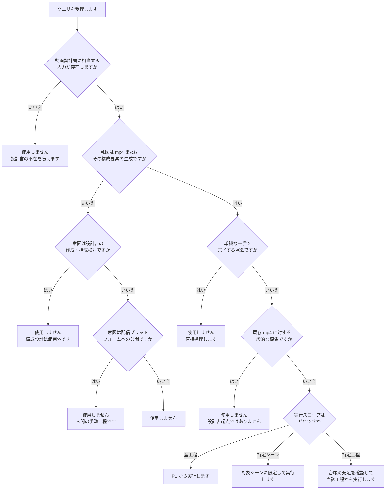
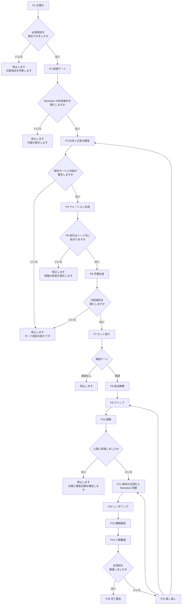

# spec-to-video

動画設計書から mp4 を生成します。工程は決定的で安価なものを前に、不可逆で課金を伴うものを後に配置しています。各工程には入口ゲートがあり、台帳の必須項目が充足していない場合は停止します。

## 発火の判定

次の両方を満たす場合に使用します。

1. 動画設計書に相当する入力が存在します（ファイルパスの提示、リポジトリ内の設計書、会話中での設計内容の提示）
2. mp4 またはその構成要素の生成を意図しています

次の場合は使用しません。

| 状況 | 理由 |
|---|---|
| 動画設計書が存在しない状態での動画制作の依頼 | 入力が欠けています。設計書の作成は別の作業です |
| 動画設計書そのものの作成・構成検討の依頼 | 本スキルの範囲外です |
| 既存 mp4 に対する一般的な編集・変換の依頼 | 設計書を起点とする工程ではありません |
| 配信プラットフォームへの公開の依頼 | 人間が手動で行う工程です |
| 単純な一手で完了する照会（尺の確認、ファイルの一覧） | 手順を要しません |

**使用を開始しただけでは、素材生成もレンダリングも始まりません。** 課金と不可逆な生成を伴う工程（P8・P9・P10）の直前に承認ゲートがあります。

## 参照ファイルの読み分け

| ファイル | 読む工程 |
|---|---|
| `references/design-doc-schema.md` | P1 |
| `references/storyboard.md` | P3・P7（絵コンテが存在する場合） |
| `references/narration-subtitles.md` | P4・P6 |
| `references/cost-and-credentials.md` | P2・P8〜P10・P12 |
| `references/mode-generative.md` | P8〜P10（`production_mode` が `generative` のとき） |
| `references/mode-remotion-only.md` | P8〜P10（`production_mode` が `remotion_only` のとき） |
| `references/remotion-project.md` | P7・P11・P12 |
| `references/compliance-review.md` | P13・P14 |

**モード別の2ファイルは、正規化した `production_mode` に応じて一方のみを読み込みます。**

## 工程

| 工程 | 名称 | 入口ゲート | 実行 |
|---|---|---|---|
| P1 | 設計書の受理と正規化 | 設計書が読み取れること | **判断**（読み取り）＋`scripts/parse_design_doc.js`（検査） |
| P2 | 前提ゲート | 環境・ライセンス・資格情報・上限が確定していること | 判断（`cost-and-credentials.md`） |
| P3 | 台本と文言の確定 | 正規化が完了していること | 判断（絵コンテがある場合は `references/storyboard.md`） |
| P4 | ナレーション合成と実尺計測 | 台本が校正済みであること | `scripts/synthesize_narration.js` |
| P5 | 尺整合ゲート | 実尺が計測済みであること | `scripts/ledger_validate.js` |
| P6 | 字幕生成と可読検査 | 尺整合が成立していること | `scripts/build_subtitles.js` |
| P7 | カット割りとトランジションの選定 | 許容クリップ長が台帳に登録されていること | 判断＋`ledger_validate.js` |
| P8 | 起点画像の生成と採否 | カット割りが確定していること | `scripts/generate_asset.js`（承認ゲート） |
| P9 | クリップの生成と採否 | 起点画像が採用済みであること | `scripts/generate_asset.js`（承認ゲート） |
| P10 | 図解画像の生成と採否 | 図解文言が校正済みであること | `scripts/generate_asset.js`（承認ゲート） |
| P11 | 素材の正規化と Remotion プロジェクト同期 | 全素材が採用済みで、トランジションが選定済みであること | `scripts/normalize_materials.js`＋判断（`remotion-project.md`） |
| P12 | レンダリング | 出力規格が設定済みであること | `scripts/render_video.js` |
| P13 | 機械検証 | mp4 が存在すること | `scripts/analyze_frames.js` |
| P14 | 人間審査 | 機械検証が完了していること | 人間 |
| P15 | 差し戻しルーティング | 検証で不適合があること | 判断 |
| P16 | 完了報告 | 全検証を通過していること | `assets/report.template.md` |

## 未決事項は尋ねます

決まっていない事項に出会ったら、**停止したうえで利用者に尋ねます。** 欠けている項目名を並べて終わりにしません。

尋ねる対象です。

| 種類 | 例 |
|---|---|
| 必須項目が設計書に無い | 課金上限が金額として書かれていない |
| 資料どうしが矛盾する | 設計書と絵コンテで常設テロップの扱いが違う |
| 判断が分かれる選択に根拠が無い | 制作モード・話者・トランジションの指定が無い |

尋ね方は `assets/question.template.md` に従い、次の4点を示します。

1. 何が決まっていないか（設計書のどこを見て分かったか）
2. なぜ必要か（どの工程が進められないか）
3. 選択肢と、それぞれの影響（費用・尺・工数・成果物）
4. 推奨する案と、その理由

**選択肢を示せない事項**（金額の上限、社内の方針、権利者の意向など）は、案を作らず、必要な情報とその記載先を示して尋ねます。

**回答を待たずに既定値で進めません。** 資料が矛盾する場合、新しい方・詳しい方を理由に一方を採ることもしません。回答の内容と根拠は実行レポートへ記録します。

## 絵コンテがある場合

絵コンテは、設計書が定めた構成をカット単位の具体まで落とした資料です。**存在する場合は P3 と P7 の入力として読みます。**

- 読み取る項目と台帳への対応、突き合わせの手順は `references/storyboard.md` にあります
- 形式は案件ごとに異なります。決まった見出しや表の形を前提にしません
- カット数・識別子・尺・素材種別が設計書と一致することを確認します
- **設計書と絵コンテで指示が矛盾する場合は停止し、確認を求めます。** 新しい方・詳しい方を自動的に採りません

絵コンテが無い案件では、P3 で台本と文言をこちらで起こします。不在は停止の理由になりません。

## トランジションの選定（P7）

カット境界に置く遷移は、**設計書の内容からこの工程で選定します**。合成側で場当たりに決めません。

- 選定の対応表と制約は `references/remotion-project.md` 6 節にあります
- 既定はクロスディゾルブです。輝度が急激に変わる遷移（暗転・ホワイトアウト）を既定にしません
- 選定した種類・長さ・理由を台本台帳の `scenes[].transitions[]` へ記録します
- 記録が無いカットがある場合、P11 の入口ゲートで停止します

## 分岐条件

| 判定 | 条件 | 分岐 |
|---|---|---|
| モード整合 | 生成主体モードの設計書に、視聴者がそのまま入力することを想定する文字列が字幕・図解文言にある | 停止します。設計書の修正が必要です |
| 尺整合 | ナレーション実尺がシーン尺を超える | 停止します。文言の短縮または尺の延長を提示します |
| 尺整合 | ナレーション実尺がシーン尺を大きく下回る | 続行します。差分を実行レポートに記録します |
| カット割り | シーン尺が許容クリップ長の組合せで一致しない | 超過分を生成し、余剰は合成側のトリムで吸収します。カット数は設計書の指定に一致させます |
| 生成の失敗 | 同一素材の生成回数がリトライ上限に達した | 当該素材を保留し、他素材を続行したうえで停止します |
| コスト | 課金額がハードキャップに達した | 全生成を停止し、台帳と課金記録を確定します |
| 再実行 | 素材台帳に採用済みの素材がある | 再生成せず既存素材を用います |

## 差し戻しルーティング

検出区間から差し戻し先を決めます。**再レンダリングで解消できる不適合に、再生成を選びません。**

| 検出区間 | 想定原因 | 差し戻し先 | 課金 |
|---|---|---|---|
| トランジション区間 | 遷移の設定・重なり | P11 | レンダのみ |
| 字幕・オーバーレイ層 | 表示時間・配置・書式 | P11 | レンダのみ |
| 単一素材の区間内 | 素材の明滅・グリッチ・映り込み | P9 または P10（該当素材のみ） | 再生成 |
| 素材が合成側で読めない | 合成規格へそろっていない | P11 | 変換のみ |
| 図解内の文言 | 誤字・文字の崩れ | P3 で文言を確定し直し、P10 | 再生成 |
| 全編にわたる規格不一致 | 出力設定 | P12 | レンダのみ |
| シーン尺・字幕文言に起因 | 設計そのもの | P3（設計書の修正が必要です） | なし |

差し戻し時、素材台帳の採用済み素材は保持し、対象素材のみを再生成の対象とします。

## 守るべきこと

- **設計書の読み取りはこちらの判断で行います。** 体裁は案件ごとに異なるため、決まった列名や表の形を前提にしません
- 設計書から抽出できない必須項目を**推測で補完しません**。欠損を列挙して停止し、選択肢を添えて尋ねます
- 素材種別は**カット単位**で持ちます。1つのシーンに図解とクリップが混在する設計書を、シーンの代表値へ丸めません
- 生成呼び出しは `scripts/generate_asset.js` のみを窓口とします。他の経路を使いません
- 生成した素材をそのまま合成へ渡しません。P11 で合成規格へそろえます。そろえていない素材は P12 で停止します
- モデル名・エンドポイント・許容クリップ長を本ファイルに書きません。設計書と実行環境から取得し、素材台帳に記録します
- 資格情報の値を、台帳・ログ・レポート・成果物のいずれにも記録しません。記載するのは環境変数名のみです
- 成果物に実在の個人を特定できる情報を含めません
- 利用者と視聴者が読む文章はですます調で書きます

## 出力

| ファイル | 内容 |
|---|---|
| `out/final.mp4` | 設計書の出力規格に適合した本編です |
| `out/subtitles.srt` | 台本台帳から生成した字幕です |
| `out/frame_analysis.json` | 明滅・赤成分・不連続フレームの検出結果です |
| `out/cost_log.json` | 生成回数・レンダ回数・課金額の記録です |
| `out/report.md` | 実行レポートです（`assets/report.template.md` に従います） |
